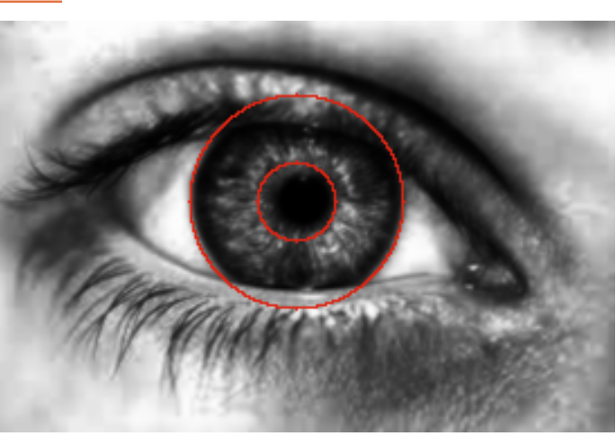

# Project Overview

This repository is divided into two main components:

1. **seismodemoapp**: An Android application built with Java that serves as the UI for users to interact with. The app allows users to select images from their device and processes them through a backend service for analysis.
   

3. **irisbackend**: A Spring Boot application that provides backend services for image processing. It receives image data from the frontend, performs various image processing operations, and returns the processed images.
    

## seismodemoapp

The `seismodemoapp` folder contains an Android project developed in Java. This application focuses on providing a user-friendly interface for selecting and sending images to the backend for processing. It utilizes Retrofit and OkHttp for network communication, handling image uploads, and receiving processed images from the backend.

### Key Features:
- Image selection from device storage.
- Image capture functionality (camera integration).
- Communication with backend services for image processing.

### Development Environment:
- Java
- Android SDK
- Retrofit for network requests

## irisbackend

The `irisbackend` folder hosts a Spring Boot project responsible for the backend image processing services. It exposes an API endpoint to receive images, processes them using custom algorithms, and returns the results.

### Key Features:
- API endpoint for receiving image uploads.
- Image processing algorithms for grayscale conversion, histogram normalization, and Gaussian filtering.
- Circle detection algorithms for iris and pupil segmentation.

### Development Environment:
- Spring Boot
- Java
- Maven for dependency management

## Getting Started

To run these projects, you will need Java installed on your system for both Android and Spring Boot applications. Android Studio is recommended for `seismodemoapp`, and any IDE with Spring Boot support (like IntelliJ IDEA or Eclipse) is suitable for `irisbackend`.

### Running seismodemoapp
1. Open the `seismodemoapp` project in Android Studio.
2. Configure an Android emulator or connect an Android device.
3. Build and run the application.

### Running irisbackend
1. Navigate to the `irisbackend` directory in your terminal or command prompt.
2. Run `mvn spring-boot:run` to start the Spring Boot application.
3. The service will be available at `http://localhost:8080/api/process` for processing images.

  
  

## Reference
https://github.com/Magdalena318/IrisRecognitionDaugman/blob/master/images.jpg
